# 第一轮实验结果：污染数据检测+模型重训练

第一轮实验主要实现了给定模型、数据集、污染目标y_target1，实现对给定数据集的污染数据检测、删除被污染的数据然后对模型重新训练等。

实验的代码已经放在服务器上`/home/ipp20aitrojan/gr/Project_Based_on_TABOR`目录下

## 第一轮实验的insight：

TABOR和BadNets实际上是相反的过程实现同一个效果：BadNets是已知触发然后训练模型把所有被污染的数据导向y_target1, 而TABOR是已知模型然后遍历所有trigger，找一个最佳的trigger使其与所有图叠加后导向y_target2（误差最小）。但是这里就有问题：

1. TABOR训练时默认y_target1=y_target2,但是这个未必成立。对于一个给定模型，如果原图叠加上BadNets的trigger就导向y_target1,如果叠加上TABOR的trigger就导向y_target2，那么如果同时叠加上这两个部分呢？这就涉及到模型对特定攻击图样的鲁棒性。这个特性可以用来做被污染数据集的判断与清除。即对于给定模型，已知了TABOR和BadNets训练的trigger和y_target1,y_target2，那么对每一张图片X而言，如果X没有被BadNets攻击，那么叠加上TABOR的trigger一定会导向y_target2。但是如果被BadNets攻击，那么叠加上TABOR的trigger就有可能导向y_target1,或者y_target2(置信度不高)。利用这个办法判断出哪些图片被污染，剔除以后重新训练就可以实现清除。

## 第一轮实验的主要步骤：

- 训练得到污染模型，运行`train_badnet.py`。第一阶段用20%（1污染数据比重可调整）的数据污染，指向y_target1=33。得到的结果保存在`Project_Based_on_TABOR`目录下面。植入木马主要分为三个维度：
  - `poison_type`：FF或whitesquare。实验验证得到FF的检验成功率高，whitesquare的误检率大约在$\frac{1}{3}​$。
  - `poison_loc`：TL或BR。其他位置同理，暂时还没有做实验；但是TL和BR效果差不多。
  - `poison_size`：4或8或16。8效果较好。
- 选择与y_target1不同的y_target2=15，运行`snooper.py`训练根据不同的模型训练反向触发`mask.npy`,`pattern.npy`（2吃透反向工程代码，在原理上处理遮挡问题）
- 运行`data_clean.py`，进行污染数据检测与比对。在这一步里把之前得到的mask的四个角上8*8的区域清零，才可以得到结果。在该程序中剔除检测出的污染数据然后重训练，在`output`目录下以`retrain`为前缀保存`.hdf5`文件。
- 运行`eval_clean.py`，评估重训练模型的效果，主要通过生成一部分无污染数据然后叠加上原来的污染数据测试预测是否会改变得到。
（解释模型对不同trigger敏感度不同的原因）

## 第一轮实验结果：

1. 数据污染检测：

   数据格式：{poison_type}-{poison_loc}-{poison_size}-{narrow_size}

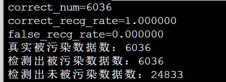

FF-BR-8

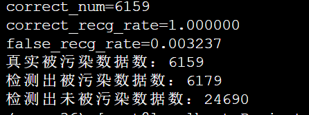

FF-TL-8

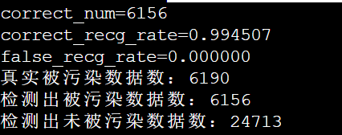

FF-TL-4

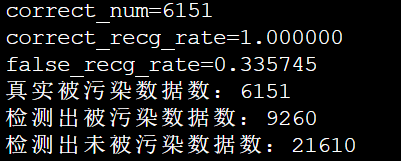

whitesquare-TL-8：存在大量误判

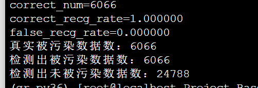

FF-TL-8-half

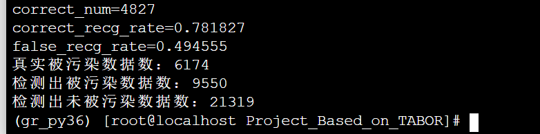

FF-TL-16：效果很差，因为反向触发与正向触发相互遮挡

---

数据证明，针对gtsrb数据集，该方法对FF的检测效果较好，正确检测率达到99.4%以上；而对于whitesquare则会包含较多（33%左右）的误判。但是误判其实并不影响数据检测的效率，因为将误判的数据清除，模型一样能被修复。影响实验效果的更多在于0.5%的漏检：这个需要继续优化。

此外，当训练mask和pattern的数据量减小到一半时，并不会对实验结果产生影响。这个有效数据量的阈值还需要继续实验测试。

2. 数据重训练：

   删除1中检测出的污染数据后，重训练得到模型`output/retrain-{poison_type}-{poison_loc}-{poison_size}_{}_{}.hdf5`。对数据清除的效果的评估，可以load一个原图数据集，然后叠加上原来的poison图样

   > 暂时用的是80%训练集+20%测试集，之后还可以重新分割训练集和测试集的比例，以达到更好的数据使用效率

   实验结果参数解释：

   1. `image removed rate`是叠加上原来的poison图样后经过网络识别label不变的数据数量/总数据量；`image unremoved rate`是叠加后label改变的数据量/总数据量。

   2. 在`unremove rate`中，指向33（初始y_target1)的数据被标志为真实未清除数据`real_unremoved`；而其他部分数据被认为是因图像叠加扰动影响模型效果的数据，其产生不因数据重训练而产生，是一个稳定的常数。这个参数可以通过对正常模型进行扰动实验得到一个平均值，然后如果本实验中的值与该平均值相差无多则认为该方法表现良好。

      > 7.27补：对扰动常数的检测：
      >
      > 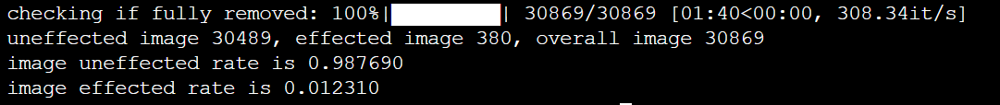
      >
      > 
FF-TL-8

      >
      > 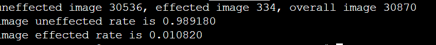
      >
      > 
FF-TL-4

      >
      > 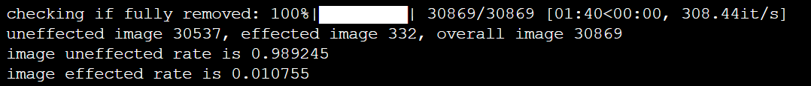
      >
      > 
FF-BR-8

      >
      > 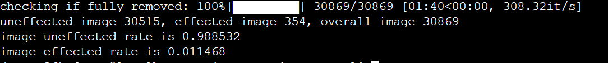
      >
      > 
whitesquare-TL-8

      >
      > 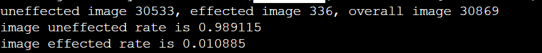
      >
      > 
whitesquare-TL-4

      >
      > 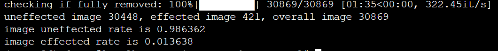
      >
      > 
whitesquare-BR-8

      >
      > **这一系列实验可以看出，扰动常数大约在1.2%左右。也就是说，对重训练模型的评估中`unremoved_rate`中有1.2%是由扰动贡献。**

   ---

   重训练结果的评估

   1. FF-TL-8：模型储存在`output/retrain-FF-TL-8-07-0.96.hdf5`

      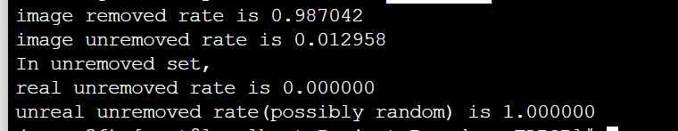

      
FF-TL-8

   2. FF-BR-8：模型储存在`output/retrain-FF-BR-8-03-0.97.hdf5`

      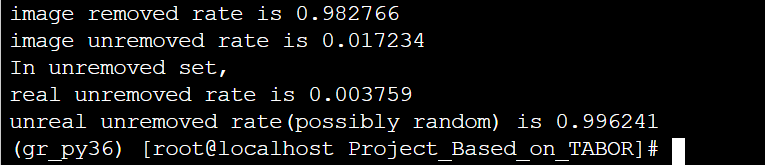

      
FF-BR-8

   3. FF-TL-4：模型储存在`output/retrain-FF-TL-4-06-0.98.hdf5`

      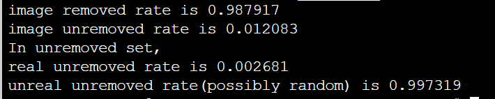

      
FF-TL-4

   4. whitesquare-TL-8：模型存储在`output/retrain-whitesquare-TL-8-10-0.97.hdf5`

      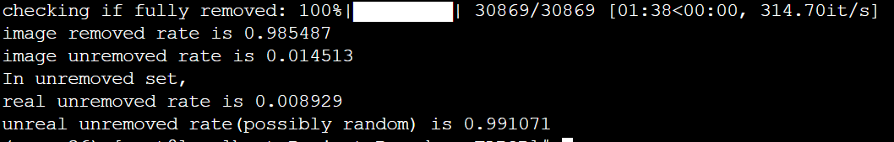

      
whitesquare-TL-8

   5. whitesquare-BR-8：模型存储在`output/retrain-whitesquare-BR-8-08-0.86.hdf5`中

      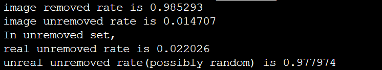

      
whitesquare-BR-8

   6. whitesquare-TL-4：模型存储在`output/retrain-whitesquare-TL-4-05-0.94.hdf5`中

      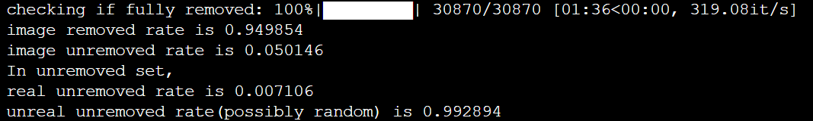

      
whitesquare-TL-4

   重训练结果的总结：

   1. 重训练结果较好，除了whitesquare-TL-4以外，别的`unremoved rate`都在扰动常数的1.2%左右，说明清除效果较好；
   2. 在清除集中，`real_unremoved_rate`占比小于1/43（随机扰动指向33的概率），说明这也不是因为trigger未被清除而产生的，而是因为随机扰动产生的。
   3. 在whitesquare-TL-4中，随机扰动扩大到了5%，原因还需要进一步研究。

---

## 后续实验计划：

1. 在检测之前加入分析y_target1的内容：STRIP方法：图叠加法。
2. 可以考虑使用grad-cam方法解释反向触发的影响；进一步分析未被污染的图与已被污染的图叠加上反向触发以后的区别，可以作为优化漏检的方法。