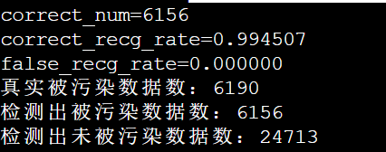
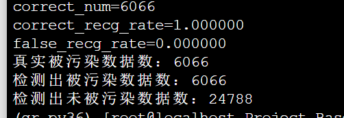

# 第一轮实验结果：污染数据检测

第一轮实验主要实现了给定模型、数据集、污染目标y_target1，实现对给定数据集的污染数据检测。第二轮即删除被污染的数据然后对模型重新训练。

实验的代码已经放在服务器上`/home/ipp20aitrojan/gr/Project_Based_on_TABOR`目录下

## 第一轮实验的主要步骤：

- 训练得到污染模型，运行`train_badnet.py`。第一阶段用20%的数据污染，指向y_target1=33。得到的结果保存在`Project_Based_on_TABOR`目录下面。植入木马主要分为三个维度：
  - `poison_type`：FF或whitesquare。实验验证得到FF的检验成功率高，whitesquare的误检率大约在$\frac{1}{3}$。
  - `poison_loc`：TL或BR。其他位置同理，暂时还没有做实验；但是TL和BR效果差不多。
  - `poison_size`：4或8或16。8效果较好。
- 选择与y_target1不同的y_target2=15，运行`snooper.py`训练根据不同的模型训练反向触发`mask.npy`,`pattern.npy`
- 运行`data_clean.py`，进行污染数据检测与比对。在这一步里把之前得到的mask的四个角上8*8的区域清零，才可以得到结果。

## 第一轮实验结果：

数据格式：{poison_type}-{poison_loc}-{poison_size}-{narrow_size}

FF-BR-8

FF-TL-8

FF-TL-4

whitesquare-TL-8：存在大量误判

FF-TL-8-half

FF-TL-16：效果很差，因为反向触发与正向触发相互遮挡

数据证明，针对gtsrb数据集，该方法对FF的检测效果较好，正确检测率达到99.4%以上；而对于whitesquare则会包含较多（33%左右）的误判。但是误判其实并不影响数据检测的效率，因为将误判的数据清除，模型一样能被修复。影响实验效果的更多在于0.5%的漏检：这个需要继续优化。

此外，当训练mask和pattern的数据量减小到一半时，并不会对实验结果产生影响。这个有效数据量的阈值还需要继续实验测试。

## 后续实验计划：

1. 将被检测出来的数据清除，然后重新训练模型；用这个方法训练得到的模型与神经元剪枝方法修复的模型进行比对，比较正确率、误判率等多层次参数。
2. 在检测之前加入分析y_target1的内容：STRIP方法：图叠加法。
3. 可以考虑使用grad-cam方法解释反向触发的影响；进一步分析未被污染的图与已被污染的图叠加上反向触发以后的区别，可以作为优化漏检的方法。